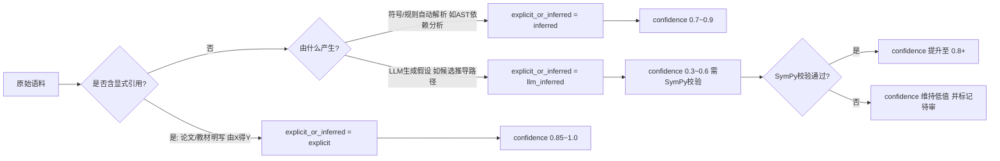
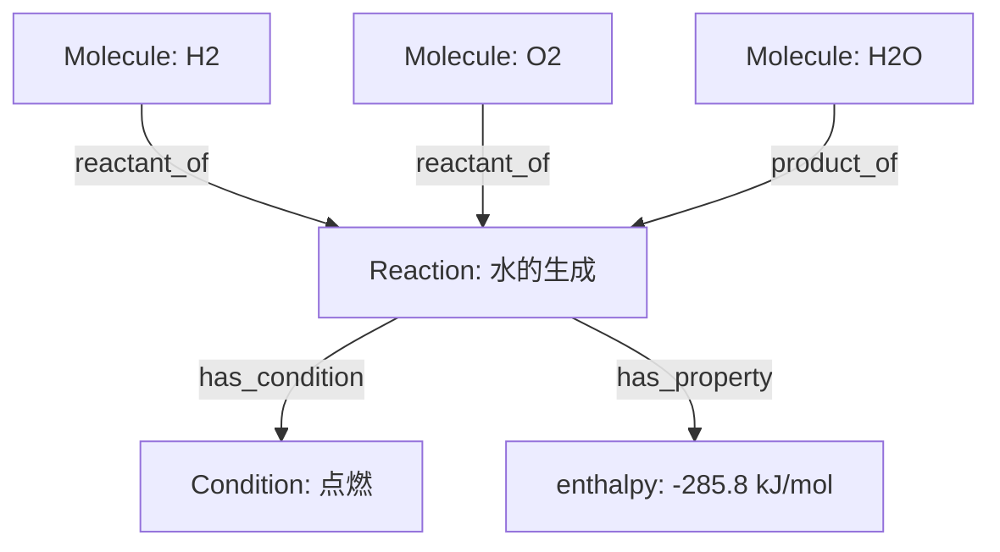
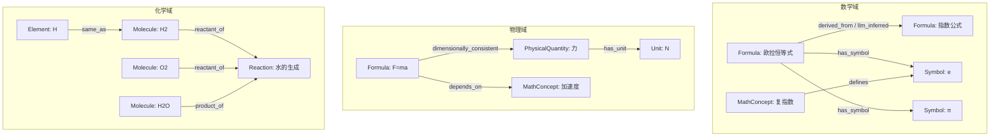

# 公式知识图谱 · 图数据模型 Schema v0.1

> 版本：v0.1 ｜ 角色：架构与数据建模专家 ｜ 适用范围：跨学科（数学 / 物理 / 化学）公式拓扑知识图谱
> 配套文档：《数据字典.md》《技术基线与环境.md》

---

## 0. 设计目标与原则

本 Schema 用于描述一个**跨学科公式拓扑知识图谱**，核心目标：

1. **统一表达**：将数学公式、物理概念、化学实体与反应统一为同一张异构图（Heterogeneous Graph），支持跨域推理。
2. **可追溯**：每条边必须携带 `source`（来源系统）、`explicit_or_inferred`（显式引用 / 推断）、`confidence`（置信度），确保 LLM 推断结果可审计。
3. **可计算**：物理量节点显式保存量纲（dimensions）与单位，化学式节点保存 SMILES/InChI，支持 SymPy 符号校验与 pint 量纲校验。
4. **超图友好**：化学反应用 `Reaction` 节点建模（而非二元边），一个反应同时关联多个反应物/生成物/条件，等价于超图（hyperedge）。

**建模约定**

- 所有节点强制含 `id`（全局唯一，建议 `类型:命名空间:key`）、`label`、`domain`、`source`、`created_at`、`version`。
- 所有边强制含 `confidence`（0.0–1.0）、`source`、`explicit_or_inferred`（枚举：`explicit` / `inferred` / `llm_inferred`）、`created_at`。
- `domain` 枚举：`math` / `physics` / `chemistry` / `cross`（跨域）。
- 三元组命名空间约定：`ns` 取自来源系统（如 `mathxiv`、`wikidata`、`elementkg`、`rxnatlas`）。

---

## 1. 节点类型（Node Labels）

### 1.1 节点总览

| 节点 Label | 含义 | 学科 | 主键样例 |
|---|---|---|---|
| `Formula` | 数学/物理公式、化学方程式推导式、恒等式 | math/physics/chem | `formula:mathxiv:euler_identity` |
| `MathConcept` | 数学/物理抽象概念（如“导数”“熵”“群”） | math/physics | `mathconcept:wikidata:derivative` |
| `Symbol` | 符号（变量、常数、算符占位） | 通用 | `symbol:mathgraph:pi` |
| `PhysicalQuantity` | 物理量（如速度、能量、电场强度） | physics | `pq:physicsbabel:velocity` |
| `Element` | 化学元素 | chemistry | `element:elementkg:H` |
| `Molecule` | 分子 / 化合物 | chemistry | `molecule:rxnatlas:h2o` |
| `Reaction` | 化学反应（超图节点） | chemistry | `reaction:rxnatlas:water_formation` |
| `Unit` | 计量单位（SI 基本/导出单位） | 通用 | `unit:si:meter` |

> 备注：`Unit` 节点可选；量纲以 `PhysicalQuantity.dimensions` 字符串（如 `L T^-1`）表达为主，单位节点用于可视化与换算。

---

### 1.2 节点属性字段详表

#### Formula（公式节点）

| 字段 | 类型 | 必填 | 说明 | 示例 |
|---|---|---|---|---|
| `id` | string | ✅ | 全局唯一 ID | `formula:mathxiv:euler` |
| `label` | string | ✅ | 人类可读名 | 欧拉恒等式 |
| `latex` | string | ✅ | LaTeX 原式 | `e^{i\pi}+1=0` |
| `canonical_form` | string | ⬜ | SymPy 规范化式 | `Eq(exp(I*pi)+1, 0)` |
| `domain` | enum | ✅ | math/physics/chem/cross | `math` |
| `description` | string | ⬜ | 语义说明 | 复指数与单位圆的桥梁 |
| `variables` | list[string] | ⬜ | 涉及 Symbol id 列表 | `["symbol:..:e","symbol:..:pi"]` |
| `embedding` | list[float] | ⬜ | 向量（用于 GNN/检索） | `[0.12, …]` |
| `source` | string | ✅ | 来源系统 | `mathxiv` |
| `created_at` | datetime | ✅ | 入库时间 | `2026-09-28T13:56:00+08:00` |
| `version` | string | ✅ | Schema 版本 | `v0.1` |

#### MathConcept（数学/物理概念）

| 字段 | 类型 | 必填 | 说明 | 示例 |
|---|---|---|---|---|
| `id` | string | ✅ | 唯一 ID | `mathconcept:wikidata:entropy` |
| `label` | string | ✅ | 名称 | 熵 |
| `definition` | string | ✅ | 定义文本 | 系统无序度的度量 |
| `domain` | enum | ✅ | math/physics/cross | `physics` |
| `aliases` | list[string] | ⬜ | 别名 | `["Entropy","S"]` |
| `source` / `created_at` / `version` | — | ✅ | 通用字段 | — |

#### Symbol（符号）

| 字段 | 类型 | 必填 | 说明 | 示例 |
|---|---|---|---|---|
| `id` | string | ✅ | 唯一 ID | `symbol:mathgraph:pi` |
| `name` | string | ✅ | 符号名 | π |
| `latex` | string | ⬜ | 渲染式 | `\pi` |
| `meaning` | string | ✅ | 语义 | 圆周率 |
| `scope` | enum | ⬜ | global/local | `global` |
| `symbol_type` | enum | ⬜ | constant/variable/operator/parameter | `constant` |
| `source` / `created_at` / `version` | — | ✅ | 通用字段 | — |

#### PhysicalQuantity（物理量）

| 字段 | 类型 | 必填 | 说明 | 示例 |
|---|---|---|---|---|
| `id` | string | ✅ | 唯一 ID | `pq:physicsbabel:velocity` |
| `name` | string | ✅ | 名称 | 速度 |
| `symbol` | string | ✅ | 常用符号 | v |
| `si_unit` | string | ✅ | SI 单位 | m/s |
| `dimensions` | string | ✅ | 量纲（L=长度,T=时间,M=质量,I=电流,Θ=温度,N=物质的量,J=发光强度） | `L T^-1` |
| `quantity_type` | enum | ⬜ | base/derived | `derived` |
| `source` / `created_at` / `version` | — | ✅ | 通用字段 | — |

#### Element（元素）

| 字段 | 类型 | 必填 | 说明 | 示例 |
|---|---|---|---|---|
| `id` | string | ✅ | 唯一 ID | `element:elementkg:H` |
| `symbol` | string | ✅ | 元素符号 | H |
| `name` | string | ✅ | 名称 | 氢 |
| `atomic_number` | int | ✅ | 原子序数 | 1 |
| `atomic_mass` | float | ✅ | 相对原子质量 | 1.008 |
| `group` / `period` | int | ⬜ | 族/周期 | 1 / 1 |
| `source` / `created_at` / `version` | — | ✅ | 通用字段 | — |

#### Molecule（分子）

| 字段 | 类型 | 必填 | 说明 | 示例 |
|---|---|---|---|---|
| `id` | string | ✅ | 唯一 ID | `molecule:rxnatlas:h2o` |
| `name` | string | ✅ | 名称 | 水 |
| `smiles` | string | ✅ | SMILES | `O` |
| `inchi` | string | ⬜ | InChI | `InChI=1S/H2O/h1H2` |
| `molecular_formula` | string | ✅ | 分子式 | H2O |
| `molar_mass` | float | ⬜ | 摩尔质量 g/mol | 18.015 |
| `source` / `created_at` / `version` | — | ✅ | 通用字段 | — |

#### Reaction（反应 · 超图节点）

| 字段 | 类型 | 必填 | 说明 | 示例 |
|---|---|---|---|---|
| `id` | string | ✅ | 唯一 ID | `reaction:rxnatlas:water_formation` |
| `label` | string | ✅ | 反应名 | 水的生成 |
| `equation` | string | ✅ | 反应方程式文本 | `2H2 + O2 -> 2H2O` |
| `reaction_type` | enum | ⬜ | synthesis/decomposition/… | `synthesis` |
| `conditions` | string | ⬜ | 条件（T/P/催化剂） | 点燃 |
| `enthalpy` | float | ⬜ | 焓变 kJ/mol | -285.8 |
| `kinetics` | string | ⬜ | 动力学表达式 | — |
| `source` / `created_at` / `version` | — | ✅ | 通用字段 | — |

#### Unit（单位，可选）

| 字段 | 类型 | 必填 | 说明 | 示例 |
|---|---|---|---|---|
| `id` | string | ✅ | 唯一 ID | `unit:si:meter` |
| `name` | string | ✅ | 名称 | 米 |
| `symbol` | string | ✅ | 符号 | m |
| `dimensions` | string | ✅ | 量纲 | `L` |
| `source` / `created_at` / `version` | — | ✅ | 通用字段 | — |

---

## 2. 边类型（Relationship Types）

### 2.1 边总览

| 边类型 | 起点 → 终点 | 语义 | 典型来源 |
|---|---|---|---|
| `derived_from` | Formula → Formula | 由…推导而来（推导依赖） | 论文/教材 |
| `proves` | MathConcept/Formula → Formula | 证明 / 支撑关系 | 论文 |
| `depends_on` | Formula → Symbol/MathConcept | 公式依赖的概念或符号 | 解析 |
| `defines` | MathConcept/PhysicalQuantity → Symbol | 定义该符号 | 定义抽取 |
| `has_symbol` | Formula → Symbol | 公式中出现该符号 | 解析 |
| `dimensionally_consistent` | Formula → PhysicalQuantity | 公式两侧量纲一致（校验通过） | SymPy+pint |
| `reactant_of` | Element/Molecule → Reaction | 是某反应的反应物 | ReactionAtlas |
| `product_of` | Element/Molecule → Reaction | 是某反应的生成物 | ReactionAtlas |
| `same_as` | 任意同型节点 → 任意同型节点 | 等价（跨源去重/对齐） | 对齐算法 |
| `has_unit` | PhysicalQuantity → Unit | 物理量对应单位 | 量纲库 |

### 2.2 边通用属性（所有边必带）

| 字段 | 类型 | 必填 | 说明 |
|---|---|---|---|
| `confidence` | float(0.0–1.0) | ✅ | 置信度 |
| `source` | string | ✅ | 来源系统或方法（如 `mathxiv`、`llm-gpt4o`、`sympy-check`） |
| `explicit_or_inferred` | enum | ✅ | `explicit` 显式引用 / `inferred` 规则推断 / `llm_inferred` 大模型推断 |
| `created_at` | datetime | ✅ | 生成时间 |
| `evidence` | string | ⬜ | 佐证（引用段落/计算记录 ID） |

### 2.3 关键边语义约束

- **`derived_from`**：起点、终点均为 `Formula`。若来自论文中“由(2)式得(3)式”则 `explicit_or_inferred=explicit`；若 LLM 推断 A 可由 B 推导则 `=llm_inferred` 且 `confidence` 较低（建议默认 ≤0.6）。
- **`dimensionally_consistent`**：由 SymPy 解析 + pint 量纲检查自动产出，属 `inferred`，`confidence=1.0`（校验通过）或 `0.0`（不一致，需告警）。
- **`reactant_of` / `product_of`**：起点为 `Element` 或 `Molecule`，终点为 `Reaction`；一条 `Reaction` 通过多条此类边形成超图语义（见 §3）。
- **`same_as`**：用于跨源实体对齐（如 Wikidata 与 ElementKG 中的“水”），去重后保留主节点，其余挂 `same_as`。

---

## 3. 显式引用 vs LLM 推断：置信度标注规范

数学依赖边（尤其 `derived_from`、`depends_on`、`proves`）的来源决定可信度，必须按以下规范标注：

**标注要点**

- `explicit`：语料中可定位到原文引用（如“由牛顿第二定律 F=ma 得…”）。
- `inferred`：由确定性规则（AST 解析、符号出现分析）得到，无主观判断。
- `llm_inferred`：LLM 提出“假设/候选依赖”，**必须经 SymPy 符号计算校验**后才可提升置信度，构成“LLM 生成假设 + 符号计算校验”闭环。
- 可视化中建议以颜色/线型区分三者（实线=explicit，虚线=inferred，点线=llm_inferred），边粗细映射 `confidence`。

---

## 4. 化学反应的超图（Hyperedge）建模

化学反应天然是多对多关系（多个反应物 → 多个生成物）。本 Schema **用 `Reaction` 节点承载超边语义**，反应物/生成物分别以 `reactant_of` / `product_of` 二元边连入 `Reaction` 节点，等价于超图的一条超边。

**优势**

1. 反应本身可携带 `conditions`、`enthalpy`、`kinetics` 等属性，二元边无法表达。
2. 一个分子可参与多个反应（`reactant_of`/`product_of` 多入边），自然形成反应网络。
3. 超图可降维为普通异构图供 NetworkX/Neo4j 存储，也可在推理层还原为超图做高阶关系学习（如 Reaction-QM 的量子化学约束）。

---

## 5. 整体图结构示意（Mermaid）

---

## 6. 索引与约束建议（Neo4j / NetworkX）

- **唯一性约束**：`CREATE CONSTRAINT FOR (n:Formula) REQUIRE n.id IS UNIQUE;` 对所有 Label 的 `id` 建立。
- **复合索引**：`Formula(domain, canonical_form)`、`PhysicalQuantity(dimensions)`、`Reaction(equation)`。
- **NetworkX 原型**：用 `nx.MultiDiGraph`，节点以 `(label, id)` 为 key，边属性含上述通用边字段；GNN 训练时按 `label` 做类型编码（RGCN/HetGNN）。

---

## 7. Schema 演进说明

- v0.1 聚焦核心 8 类节点 + 11 类边，覆盖推导依赖、量纲一致、反应关联三大主轴。
- 后续版本（v0.2+）可增：`Theorem`、`ProofStep`、`Dataset`、`Experiment` 节点，以及 `cites`、`contradicts`、`calibrated_by` 等边，支撑更强的假设生成闭环。
