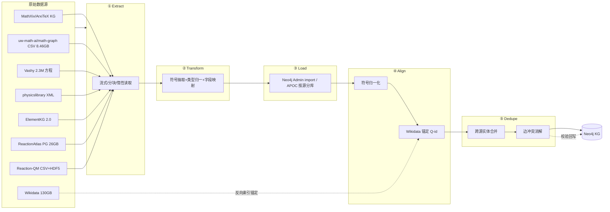
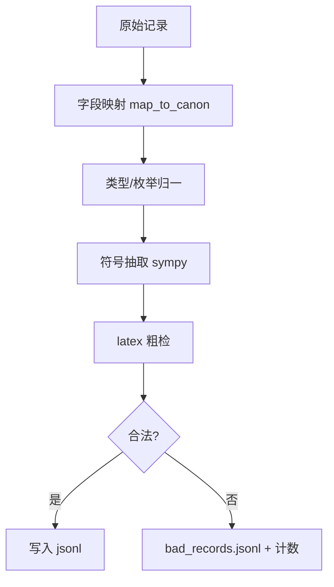
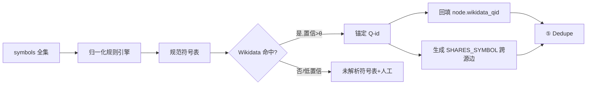
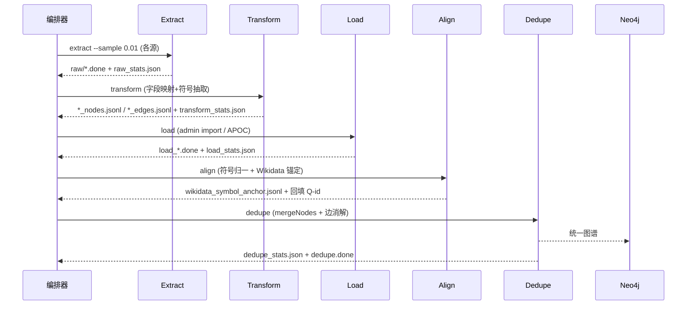

# ETL 管道设计（ETL Pipeline Design）

> 文档定位：公式知识图谱项目「数据层」的**管道编排蓝图**。描述从原始数据源 → 标准化中间格式（JSON Lines）→ 图数据库（Neo4j）的完整 ETL 流程，含分阶段定义、工具选型、跨源对齐、重试与校验点。
> 前置规范：`02_数据层/数据源接入规范.md`（格式/规模/字段映射）。
> PoC 数据：`06_PoC/sample_mathxiv.json`。

---

## 1. 设计目标与约束

| 目标 | 约束 |
|---|---|
| **可扩展** | 单源 8.46 GB（math-graph）须零 OOM 流式处理 |
| **可重跑** | 每阶段幂等（`--resume` + 检查点），失败可从断点续跑 |
| **可校验** | 每阶段产出指标（计数/丢弃率/冲突数），异常即告警 |
| **可对齐** | 跨源符号归一 + Wikidata 锚定，消除重复实体 |
| **渐进式** | 先 1% 采样跑通，再全量（见接入规范第 4 节） |

---

## 2. 总体架构与阶段划分

管道分为 **5 个阶段**：Extract → Transform → Load → Align → Dedupe。前 4 阶段产出物均为 JSON Lines（标准化中间格式），Dedupe 产出最终可导入的合并文件，最终由 Neo4j Admin import / APOC 落库。



---

## 3. 阶段详解

### ① Extract（抽取）

| 项 | 内容 |
|---|---|
| **输入** | 各源原始文件/库（JSON / CSV / XML / PG / HDF5 / Wikidata dump） |
| **输出** | 原始记录的**只读快照**（落 `staging/raw/<source>/`，不改动源） |
| **工具** | `ijson` / `lxml.iterparse`（流式 XML）/ `polars.scan_csv` / `duckdb`（CSV 直查）/ `psycopg2` 游标 / `h5py` 切片 / `bz2`+`ijson`（Wikidata） |
| **关键动作** | 1% 采样子命令 `extract --sample 0.01` 优先；超大源走分块（chunksize 10万行） |
| **检查点** | 每源完成写 `.done` 标记 + `raw_stats.json`（行数/字节/采样率） |
| **失败重试** | 分块级重试；单块失败记录 `failed_blocks.txt`，支持 `extract --resume` |

> math-graph 特例：用 `duckdb` 执行 `CREATE TABLE smp AS SELECT * FROM read_csv('statement_informal.csv') USING SAMPLE 1% (bernoulli)` 直接落采样小表，避免 5GB 文件入内存。

---

### ② Transform（转换）

| 项 | 内容 |
|---|---|
| **输入** | `staging/raw/<source>/` 原始快照 |
| **输出** | 标准化中间格式 JSON Lines（`staging/<source>_nodes.jsonl` / `_edges.jsonl`） |
| **工具** | `pandas` / `polars`（批处理）、`sympy` / `latex2sympy2`（LaTeX→符号抽取）、自定义映射器（按接入规范第 2 节字段映射表） |
| **关键动作** | ① 字段映射（源→中间格式）② 类型枚举归一（THEOREM/LEMMA/…）③ 符号抽取填 `props.symbols` ④ latex 粗检（编译性）⑤ 边 `confidence` 归一到 [0,1] |
| **检查点** | 每源输出 `.done` + `transform_stats.json`（节点数/边数/符号数/丢弃数） |
| **失败重试** | 记录级 try/except，坏记录入 `bad_records.jsonl` 并计数，不中断整体 |

**Transform 内部子流（Mermaid）**



---

### ③ Load（加载）

| 项 | 内容 |
|---|---|
| **输入** | 标准化 JSON Lines |
| **输出** | Neo4j 中**按源分库/分标签**的初始图（每源独立的子图，便于回滚） |
| **工具** | `neo4j-admin database import`（`--nodes` / `--relationships`，适合首建大批量、离线快）；增量/小批用 `APOC`（`CALL apoc.periodic.iterate` 批量MERGE） |
| **关键动作** | 节点用 `MERGE (n:SourceLabel {id:$id})` 防重；边用 `MATCH (a),(b) MERGE (a)-[r:KIND]->(b)` |
| **检查点** | 每源加载完成写 `load_<source>.done` + `load_stats.json`（实际入库节点/边） |
| **失败重试** | `apoc.periodic.iterate` 自带批失败重试；admin import 失败重跑需先清空目标库 |

> 建议：首次 PoC 用 `neo4j-admin import` 全量建库（性能最佳）；后续增量用 APOC MERGE。

---

### ④ Align（对齐）

跨源对齐是图谱价值核心，分两步：**符号归一化** → **Wikidata 锚定**。

| 步骤 | 输入 | 输出 | 工具 |
|---|---|---|---|
| 4.1 符号归一化 | 所有 `props.symbols` | 规范符号表（消歧：G/G_μν/𝒢 → G） | 正则 + 下标/花体剥离规则 + 人工规则集 |
| 4.2 Wikidata 锚定 | 规范符号表 | `symbol → Q-id` 映射（`wikidata_symbol_anchor.jsonl`） | `requests` 调 Wikidata SPARQL / `wbsearchentities`，或离线 dump 子集索引 |
| 4.3 回填 | 锚定表 | 节点 `props.wikidata_qid` 回填；生成 `SHARES_SYMBOL` 跨源边 | APOC `MERGE` + `CALL apoc.create.relationship` |

**对齐流程（Mermaid）**



---

### ⑤ Dedupe（去重合并）

| 项 | 内容 |
|---|---|
| **输入** | 各源已对齐子图 |
| **输出** | 合并后的**统一知识图谱**（重复实体合并、边冲突消解） |
| **策略** | ① `wikidata_qid` 相同 → 合并为同一节点（保留多 `source` 溯源）② 同一 `(source,target,kind)` 边取 `max(confidence)`，来源互补则保留多条并存 ③ 符号级重复经 4.3 的 `SHARES_SYMBOL` 聚簇 |
| **工具** | APOC `apoc.refactor.mergeNodes`（合并）、`apoc.periodic.iterate`（批处理）、Cypher `CALL { } IN TRANSACTIONS` |
| **检查点** | `dedupe_stats.json`（合并前/后节点数、合并对数、丢弃边） |
| **失败重试** | 批级 MERGE，单批失败重跑该批 |

**示例 Cypher（合并同源 Q-id 实体）：**

```cypher
MATCH (n)
WHERE n.wikidata_qid IS NOT NULL
WITH n.wikidata_qid AS qid, COLLECT(n) AS nodes
WHERE SIZE(nodes) > 1
CALL apoc.refactor.mergeNodes(nodes, {properties:'discard', mergeRels:true}) YIELD node
RETURN count(node);
```

---

## 4. 工具选型总表

| 阶段 | 主工具 | 备选 | 用途 |
|---|---|---|---|
| Extract | `duckdb` / `polars` | `ijson` / `psycopg2` / `h5py` | 超大文件零 OOM 读取 |
| Transform | `pandas` / `polars` | `sympy` | 映射 + 符号抽取 |
| Load | `neo4j-admin import` | `APOC` | 首建/增量 |
| Align | `requests` + 规则引擎 | 离线 Wikidata 索引 | 符号归一 + 锚定 |
| Dedupe | `APOC` | Cypher 批处理 | 合并 + 冲突消解 |
| 编排 | `prefect` / `Airflow` / 纯 Python + `argparse` | — | DAG 调度 + 检查点 |

---

## 5. 失败重试与校验点机制

### 5.1 检查点（Checkpoint）层级

| 层级 | 标记文件 | 重跑入口 |
|---|---|---|
| 源级 | `raw/<source>.done` | `extract --source <s> --resume` |
| 转换级 | `<source>_nodes.jsonl.done` | `transform --source <s> --resume` |
| 加载级 | `load_<source>.done` | `load --source <s> --resume` |
| 对齐级 | `align.done` | `align --resume` |
| 去重级 | `dedupe.done` | `dedupe --resume` |

### 5.2 重试策略

- **瞬时失败**（网络/连接）：指数退避（1s→2s→4s，最多 5 次）。
- **块级失败**（解析异常）：记录 `failed_blocks.txt`，跳过坏块、计数、续跑。
- **全阶段失败**：依据 `.done` 标记从最近完成阶段续跑，不重做已完成部分。
- **数据质量失败**：坏记录入 `bad_records.jsonl`，阈值告警（丢弃率 >5% 触发人工评审）。

### 5.3 校验指标（每阶段必产出）

```json
{
  "stage": "transform",
  "source": "mathgraph",
  "rows_in": 2325320,
  "nodes_out": 1983000,
  "edges_out": 4120000,
  "symbols_extracted": 53021,
  "bad_records": 1287,
  "discard_rate": 0.00055,
  "sample_rate": 0.01,
  "ts": "2026-09-28T13:56:00+08:00"
}
```

---

## 6. 端到端管道编排（Mermaid 时序）



---

## 7. PoC 执行计划（先 1% 后全量）

1. **Week 1**：接入 MathXiv 样例（`06_PoC/sample_mathxiv.json`）+ math-graph 1% 采样，跑通 Extract→Transform→Load。
2. **Week 2**：接入 Vashy 1% + ElementKG 抽样，打通 Align（符号归一 + Wikidata 锚定 PoC）。
3. **Week 3**：Dedupe 合并三源子图，产出 PoC 图谱，做拓扑查询验证（依赖链、符号共享簇）。
4. **Week 4+**：解除采样，全量跑通，压测 Neo4j 导入与查询性能。

---

## 8. 风险与缓解

| 风险 | 缓解 |
|---|---|
| math-graph 8.46GB 内存溢出 | duckdb/polars 惰性 + 分块 + 先 1% |
| 符号歧义（同符号多含义） | Wikidata 上下文消歧 + 置信阈值 + 人工兜底 |
| 跨源 ID 冲突 | 全局 `id = <source>:<local_id>`，合并仅发生在对齐后 |
| 加载中断导致图不一致 | 分源子图隔离 + `.done` 检查点，可单源回滚 |
| Wikidata 在线查询限流 | 离线 dump 子集建倒排索引，批量锚定 |

---

## 9. 配套产物索引

- `02_数据层/数据源接入规范.md` — 格式/规模/字段映射/采样
- `02_数据层/ETL管道设计.md` — 本文件
- `06_PoC/sample_mathxiv.json` — MathXiv 风格合成样例（PoC 输入）
- `02_数据层/staging/` — 运行时中间产物（jsonl / 检查点）
