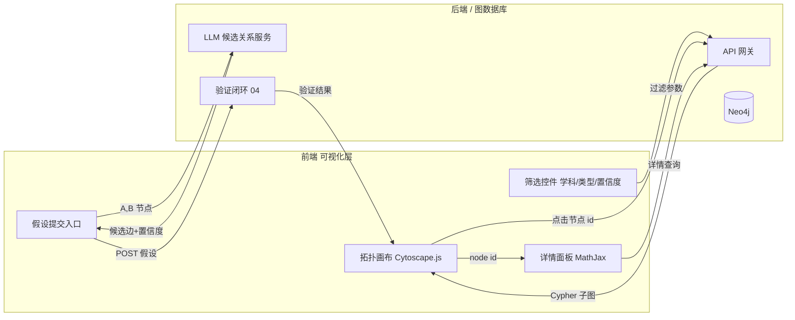

# 公式知识图谱 · 可视化原型设计

> 文档定位：交互层（可视化前端）的总体设计说明，供「自定义拓扑浏览」模块与 PoC 原型开发参考。
> 适用范围：跨学科公式知识图谱（数学 / 物理 / 化学），技术栈聚焦 **D3.js / Cytoscape.js**，并实现与 Neo4j 后端的接口约定。

---

## 0. 设计目标与设计约束

**目标**

1. 让研究者以"拓扑"视角浏览公式之间的**派生 / 依赖 / 量纲一致 / 反应**等关系，而非逐条查表。
2. 把一个公式的 **LaTeX 定义、证明（proof）、来源、置信度** 在点击时即时呈现。
3. 提供"假设提交"入口：用户或 LLM 提出候选关系，进入验证闭环（对应 `04_验证闭环`）。
4. 图规模具备可扩展性：从小图（几千节点）到百万级图谱，交互层不崩。

**硬约束**

- 节点/边需携带**学科、类型、置信度、显式/推断**等语义，并在视觉上可区分。
- 公式必须 **LaTeX 渲染**（MathJax / KaTeX），不能只显示纯文本。
- 交互层需与后端解耦：前端只认 API / Cypher 结果，不直接耦合存储。

---

## 1. 交互层功能清单

| # | 功能模块 | 子能力 | 说明 / 备注 |
|---|----------|--------|-------------|
| 1 | **拓扑浏览** | 平移 / 缩放 / 适配视图 | 支持鼠标拖拽、滚轮缩放、`fit` 一键全览 |
| 1.1 |  | 布局切换 | cose（力导） / concentric（按度数同心） / breadthfirst（按派生层级） / dagre（有向无环） |
| 1.2 |  | 聚焦与邻居展开 | 点击节点 → 高亮其 N 度邻居，其余淡出（focus mode） |
| 1.3 |  | 路径追溯 | 选两个节点 → 高亮最短路径 / 全部路径（派生链、依赖链） |
| 2 | **节点筛选** | 按学科 | 数学 / 物理 / 化学 / 跨学科（多选） |
| 2.1 |  | 按节点类型 | Formula / MathConcept / Symbol / PhysicalQuantity / Molecule / Element / Reaction |
| 2.2 |  | 按名称/公式搜索 | 输入框即时过滤（含 LaTeX 文本模糊匹配） |
| 3 | **边筛选** | 按边类型 | derived_from / depends_on / dimensionally_consistent / reactant_of / product_of |
| 3.1 |  | 按置信度 | 滑块：仅显示 confidence ≥ 阈值的边 |
| 3.2 |  | 按来源 | 显式（explicit，来自文献/本体的实线）vs 推断（inferred，LLM/规则推导的虚线） |
| 4 | **节点详情** | LaTeX 渲染 | 用 MathJax 渲染 `latex` 字段 |
| 4.1 |  | 定义 / 证明 | 展示 `definition`、`proof`、`source` |
| 4.2 |  | 邻居关系列表 | 列出相连边（类型 + 对端 + 置信度），点击可跳转 |
| 4.3 |  | 元信息 | 学科、类型、置信度、创建时间、验证状态 |
| 5 | **假设提交入口** | 候选关系生成 | 选中节点 A、B → 调 LLM 生成"候选关系 + 理由 + 预估置信度" |
| 5.1 |  | 提交与状态 | 提交为 `Hypothesis` 节点/边，进入 `04_验证闭环` 待审队列 |
| 5.2 |  | 可视化标注 | 提交的推断边以特殊样式（如粉色虚线 + 问号标记）临时叠加 |

> 说明：第 5 类功能在前端为"入口 + 渲染"，真正的 LLM 推理与验证在后端/验证闭环完成。

---

## 2. 技术选型对比

### 2.1 候选方案

| 方案 | 定位 | 渲染层 | 大规模（≥10万节点） | LaTeX 友好度 | 上手/定制 | 生态 |
|------|------|--------|----------------------|--------------|-----------|------|
| **Cytoscape.js** | 专注图/网络分析 | Canvas（默认）/ WebGL（实验） | 1万~5万流畅，超大规模需分片/采样 | 中（详情面板用 MathJax 即可） | **快**（声明式 stylesheet） | **丰富**（edgehandles / navigator / popper / context-menus / dagre / cola） |
| **D3.js** | 通用可视化原语 | SVG / Canvas / WebGL（自接 regl·three） | 取决于自写渲染，WebGL 可百万级 | 高（可任意嵌入 SVG/HTML） | **慢**（一切自写） | 最大，但需自己拼装 |
| **AntV G6** | 关系/流程图专用 | Canvas / SVG / **WebGL** | **强**（WebGL renderer 原生支持大图） | 中 | 中（中文文档好） | 较好，含图分析、布局、交互 |
| **vis-network** | 快速原型 | Canvas | 较弱（万级开始吃力） | 中 | **最快** | 一般 |
| **sigma.js** | WebGL 大图 | WebGL | **极强**（10万~百万） | 低（需自绘标签） | 中 | 专注大图 |

### 2.2 推荐与理由

**主引擎：Cytoscape.js（MVP / PoC 与日常探索）**

- 它是"为关系图而生的库"：节点/边/选择器/样式表/事件都是一等公民，做一个带筛选、聚焦、详情面板的探索 UI 只需要几百行代码。
- 内置多种图布局（cose / concentric / breadthfirst），并可通过扩展接入 dagre、cola，覆盖"派生层级""度数同心"等需求。
- 生态成熟：tooltip（popper）、缩放导航（navigator）、边编辑（edgehandles）、右键菜单都能直接复用，省去大量自研交互。

**规模升级路径（≥10万 ~ 百万级）：G6 或 sigma.js**

- 当图规模进入十万/百万级，Cytoscape 的 Canvas 渲染会掉帧。此时两种策略：
  1. **前端换渲染器**：用 **AntV G6（WebGL renderer）** 或 **sigma.js** 接管大图渲染，交互范式与 Cytoscape 接近，迁移成本低；
  2. **服务端预布局 + 前端分块**：Neo4j/图计算产出坐标与子图，前端只渲染视口内节点（viewport tiling），无论用哪个库都能撑住。
- G6 因中文文档、内置图分析与 WebGL 渲染，是本项目的"规模兜底首选"。

**定制模块：D3.js（仅在需要时）**

- 对于 Cytoscape 抽象不够用的**定制可视化**（如：公式的放射性证明树、化学反应超图的真正超边绘制、时间演化动画），用 **D3.js + SVG/WebGL** 单独实现成独立组件，嵌入主界面。
- 不建议用 D3 从零搭主图谱——交互（框选、合并、布局切换）都要重写，ROI 低。

> **结论**：默认用 **Cytoscape.js** 做主交互引擎 + **MathJax** 渲染 LaTeX；规模上探时切 **G6/WebGL** 或"服务端预布局+分块"；**D3.js** 仅用于定制子模块。本仓库 `06_PoC/graph_view.html` 即基于 Cytoscape.js 实现。

---

## 3. 视觉编码方案

### 3.1 节点编码（双通道：学科 + 类型）

> 采用"**填充色 = 学科**，**描边色 = 类型**"的双编码，一次看清"跨哪个学科"与"是什么角色"。

**学科（填充色 `background-color`）**

| 学科 | 颜色 | 色值 |
|------|------|------|
| 数学 Mathematics | 蓝 | `#4C72B0` |
| 物理 Physics | 橙 | `#DD8452` |
| 化学 Chemistry | 绿 | `#55A868` |
| 跨学科 Cross | 灰紫 | `#8C8C9A` |

**类型（描边色 `border-color` + 形状 `shape`）**

| 节点类型 | 描边色 | 形状 | 示例 |
|----------|--------|------|------|
| Formula 公式 | `#1f77b4` | 圆角矩形 `round-rectangle` | 勾股定理 |
| MathConcept 数学概念 | `#9467bd` | 椭圆 `ellipse` | 直角三角形 |
| Symbol 符号 | `#8c564b` | 菱形 `diamond` | a, c |
| PhysicalQuantity 物理量 | `#e377c2` | 六边形 `hexagon` | 长度 L |
| Molecule 分子 | `#2ca02c` | 三角形 `triangle` | H₂O |
| Element 元素 | `#ff7f0e` | 八边形 `octagon` | O |
| Reaction 反应 | `#d62728` | 星形 `star` | 2H₂+O₂→2H₂O |

**尺寸**：默认按度数（连接数）映射节点大小；可选按 `confidence` 或"被引用次数"放大，突出核心公式。

### 3.2 边编码（类型 + 来源 + 置信度）

| 维度 | 编码方式 |
|------|----------|
| **边类型 kind** | 颜色（见下表） |
| **来源 explicit_or_inferred** | **实线 = 显式（文献/本体）**；**虚线 = 推断（LLM/规则）** |
| **置信度 confidence** | 透明度 + 线宽：高置信→不透明且粗（如 0.95→5px/α1.0），低置信→淡且细（0.6→1px/α0.4） |
| **方向** | 箭头指向（target-arrow），如 `derived_from` 指向"被派生出的"公式 |

**边类型配色**

| 边类型 | 颜色 | 语义 |
|--------|------|------|
| derived_from 派生自 | `#1f77b4` | A 由 B 推导而来 |
| depends_on 依赖 | `#ff7f0e` | A 依赖 B 的概念/符号 |
| dimensionally_consistent 量纲一致 | `#2ca02c` | 两边量纲可对齐 |
| reactant_of 反应物 | `#d62728` | 元素/分子是某反应的反应物 |
| product_of 产物 | `#9467bd` | 元素/分子是某反应的产物 |

> **过滤联动**：当用户按"置信度阈值"过滤时，低于阈值的边淡出/隐藏；按"来源"过滤时，inferred 虚线整体可关，便于只看"被文献坐实的"关系。

### 3.3 超图（化学反应）如何呈现

化学反应天然是**超边**（多个反应物 + 多个产物同时参与）。两种呈现策略：

**策略 A（推荐，Cytoscape 友好）：Reaction 中心节点辐射**
- 把每个 `Reaction` 当作一个**星形节点**，反应物通过 `reactant_of`（入边）连到它，产物通过 `product_of`（出边）连到它。
- 优点：完全落在普通有向图模型里，Cytoscape 原生支持，筛选/聚焦/导出都一致。
- 视觉增强：Reaction 节点使用星形 + 红色描边，并可用 `cytoscape-compound-nodes` 或"透明包围节点"把参与者框成一组，模拟超边包裹感。

```
        reactant_of ↘        ↙ product_of
   (O₂) ───────► (Reaction ★) ◄─────── (H₂O)
   (H₂) ───────►  2H₂+O₂→2H₂O
```

**策略 B（真·超边，D3 定制）：包裹式超边**
- 用 D3 绘制一条"包围盒/胶囊"把全部参与者括起来，内部标注反应式 LaTeX；适合反应网络专题视图，不参与主拓扑筛选。
- 适用：反应机理详解页、化学子图专题。

> 主图谱默认用 **策略 A**；化学专题视图可叠加 **策略 B**。

---

## 4. 页面布局与组件草图

### 4.1 总体布局（ASCII 草图）

```
┌──────────────────────────────────────────────────────────────────────┐
│ 顶栏 Header                                                            │
│ [公式知识图谱]  搜索框🔍(公式/概念)   [布局▾] [适配] [聚焦模式] [主题]  │
├──────────┬───────────────────────────────────────────────┬───────────┤
│ 左栏       │  中栏：图谱画布 (Cytoscape.js)                  │ 右栏        │
│ 筛选面板   │                                                │ 详情面板    │
│ ───────   │        ●(Formula 勾股定理)                     │ ─────────  │
│ □ 学科     │       /|\ derived_from                         │ 类型/学科   │
│   ☑数学    │      / | \                                     │ LaTeX:      │
│   ☑物理    │     /  |  \ depends_on                         │  [公式渲染] │
│   □化学    │    /   |   ●(MathConcept 直角)                 │ 定义:       │
│ ───────   │   ●     |                                      │ 证明:       │
│ □ 节点类型 │ (Symbol a)    ●(Formula 余弦定理)              │ 来源:       │
│ ───────   │                dimensionally_consistent         │ 邻居:       │
│ □ 边类型   │                     ─ ─ ─ (虚线=inferred)      │  [列表跳转] │
│ ───────   │                                                │            │
│ 置信度 ≥[▪──]0.7                                               │            │
│ ───────   │  [缩放条] [导航小窗]                              │            │
│ 图例 Legend│                                                │            │
│ (色块说明) │                                                │            │
├──────────┴───────────────────────────────────────────────┴───────────┤
│ 底栏：假设提交 Hypothesis Bar                                           │
│ 选 A:[勾股定理] 选 B:[余弦定理] [LLM 生成候选关系] → 预览: 派生自(0.9)    │
│ [提交待审]  [查看验证队列↗]                           状态: ●已连后端    │
└──────────────────────────────────────────────────────────────────────┘
```

### 4.2 数据/交互流（Mermaid）



### 4.3 组件清单（前端）

| 组件 | 职责 | 关键依赖 |
|------|------|----------|
| `GraphCanvas` | 图谱渲染、布局、缩放、聚焦 | Cytoscape.js |
| `FilterPanel` | 学科/类型/置信度/来源过滤 | 状态管理 |
| `DetailPanel` | 选中节点/边详情 + LaTeX | MathJax |
| `SearchBox` | 名称/LaTeX 模糊搜索 | 后端 `/api/search` |
| `HypothesisBar` | 假设提交入口 | 后端 LLM 服务 |
| `Legend` | 颜色/形状/线型图例 | 静态配置 |
| `Toolbar` | 布局切换 / 适配 / 路径追踪 | Cytoscape API |

---

## 5. 与后端（Neo4j Cypher / API）的接口约定雏形

> 原则：前端只消费 **JSON 子图**（`{nodes:[...], edges:[...]}`），不感知 Cypher；Cypher 由后端 Gateway 拼装与参数化，防注入。

### 5.1 通用响应结构

```json
{
  "nodes": [
    {
      "id": "f_pyth",
      "labels": ["Formula"],
      "subject": "数学",
      "name": "勾股定理",
      "latex": "c^{2}=a^{2}+b^{2}",
      "definition": "直角三角形两直角边平方和等于斜边平方。",
      "proof": "...",
      "source": "Euclid《几何原本》I.47",
      "confidence": 0.95
    }
  ],
  "edges": [
    {
      "id": "e1",
      "source": "f_lawcos",
      "target": "f_pyth",
      "kind": "derived_from",
      "confidence": 0.90,
      "explicit_or_inferred": "explicit"
    }
  ]
}
```

### 5.2 REST 端点

| 方法 | 路径 | 说明 | 关键参数 |
|------|------|------|----------|
| GET | `/api/graph/subgraph` | 取子图（用于初始加载/展开） | `root`, `depth`(1~3), `nodeTypes[]`, `edgeTypes[]`, `minConfidence`, `subjects[]` |
| GET | `/api/node/:id` | 节点详情（含 proof/source） | `id` |
| GET | `/api/search?q=` | 名称/LaTeX 模糊搜索（autocomplete） | `q`, `limit` |
| GET | `/api/path?a=&b=&kind=` | 两节点间路径（派生链/依赖链） | `a`, `b`, `maxLen` |
| POST | `/api/hypotheses` | 提交 LLM 候选关系 | body: `{source,target,kind,rationale,confidence}` |
| GET | `/api/hypotheses?status=` | 验证队列（对接 `04_验证闭环`） | `status`(pending/reviewed/rejected) |

### 5.3 后端内部 Cytoscape→Neo4j 映射（示例 Cypher）

```cypher
// 取某公式 N 度邻居子图（参数化，防注入）
MATCH (n {id:$root})-[r*1..$depth]-(m)
WHERE ALL(rel IN r WHERE rel.confidence >= $minConfidence)
RETURN n, r, m
LIMIT $limit;
```

```cypher
// 按学科+类型过滤的全局抽样（大图用采样而非全量）
MATCH (n:Formula)
WHERE n.subject IN $subjects
RETURN n LIMIT $sampleSize;
```

```cypher
// 提交假设：写为待审 Hypothesis 关系
MATCH (a {id:$source}), (b {id:$target})
CREATE (a)-[:HYPOTHESIS {
  kind:$kind, confidence:$confidence,
  rationale:$rationale, status:'pending'
}]->(b);
```

### 5.4 大图策略（百万级）

1. **初始只取"核心子图"**：按 `degree`/`PageRank` 取 Top-N + 用户聚焦展开，避免一次性全量。
2. **服务端预布局**：Neo4j 或图计算（GraphX/NetworkX）算好坐标，前端只读坐标渲染，"服务端预布局 + 前端分块（viewport tiling）"。
3. **推理转移到 Worker**：置信度过滤/路径计算放 Web Worker 或后端，避免阻塞 UI 线程。
4. **渲染兜底**：超 10 万节点切 G6/WebGL 或 sigma.js（见 §2.2）。

---

## 6. PoC 与原型交付

- **本设计对应的可运行原型**：`06_PoC/graph_view.html`
  - 单文件、CDN 引入 Cytoscape.js + MathJax，双击即可打开，无需后端。
  - 内置一份数学样例小图（勾股定理↔距离公式↔余弦定理等）。
  - 已实现：节点渲染（学科填充 + 类型描边）、点击详情面板（LaTeX 渲染）、按置信度/边类型/节点类型/学科过滤。
- **下一步**：把 `graph_view.html` 的数据源替换为 §5 的 `/api/graph/subgraph`，即可升级为真实系统前端。

---

*文档版本 v0.1 · 可视化与前端专家 · 2026-09-28*
